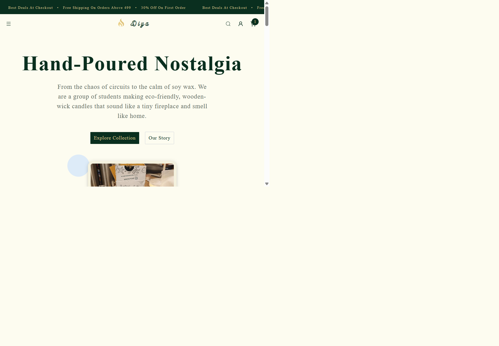
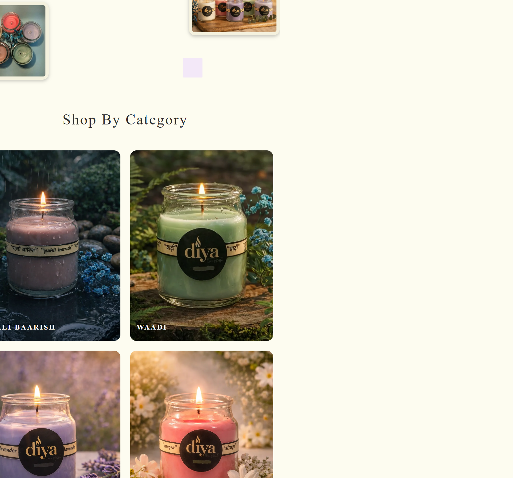
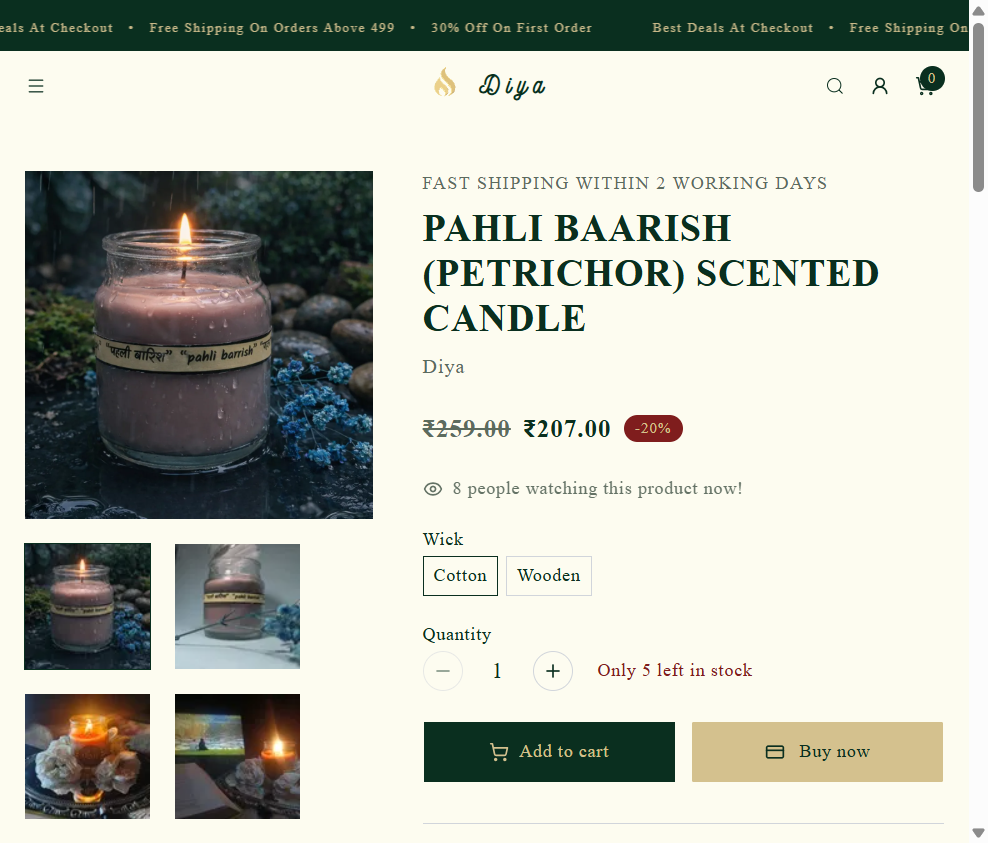
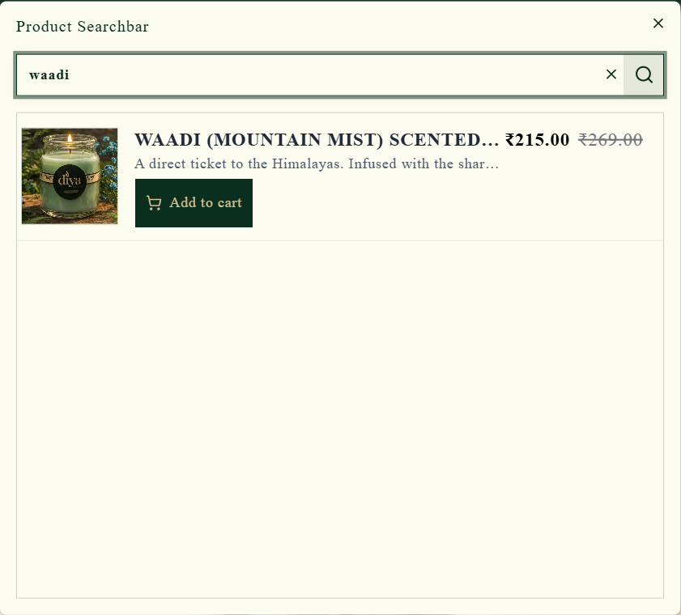
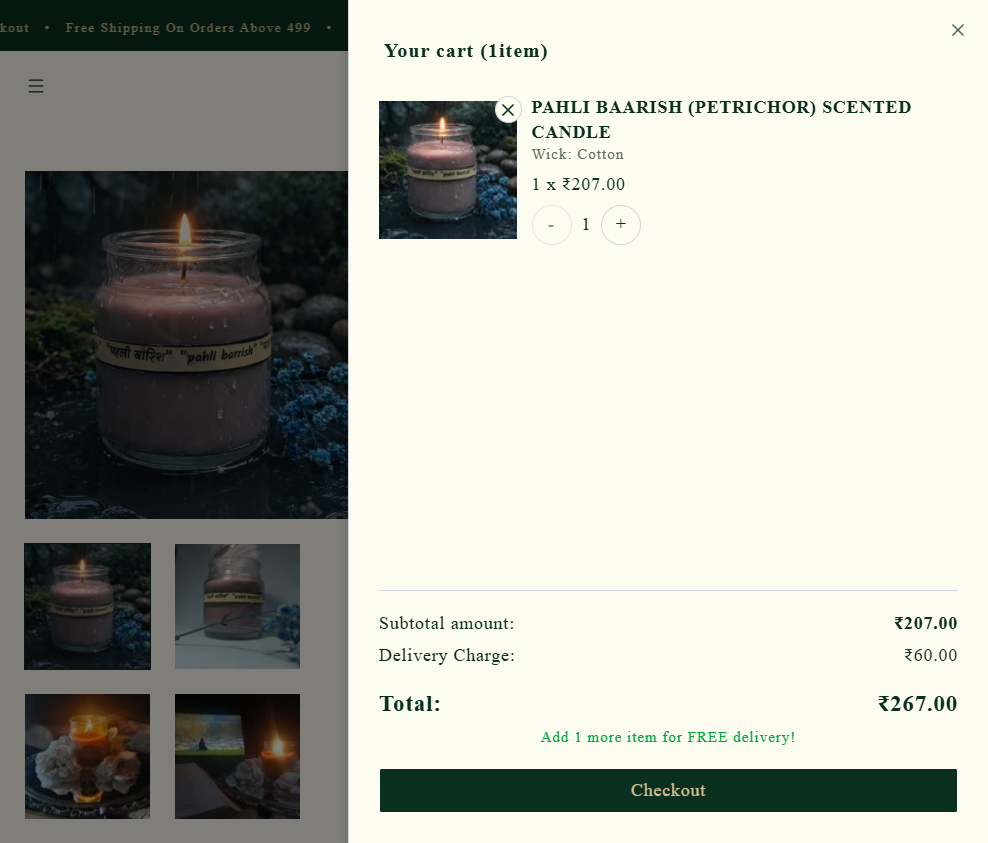
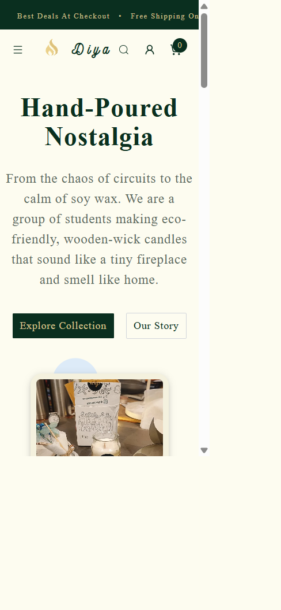

# AuraShop

## Overview

AuraShop is a responsive e-commerce application for handcrafted products, built with Next.js, React, Tailwind CSS, and Zustand. The current storefront showcases Diya's handcrafted scented candles, with product discovery, variant selection, cart management, and online checkout.

The live Diya storefront is available at [apnadiya.in](https://apnadiya.in). The deployed storefront retains the Diya brand; AuraShop is the name of this portfolio project.

## Features

- Responsive storefront for desktop, tablet, and mobile screens.
- Product collections, product details, image galleries, and selectable variants.
- Search and product discovery flows.
- Cart state managed with Zustand and persisted in the database for signed-in or guest sessions.
- Product discounts and coupon support.
- Customer authentication, saved addresses, order history, and checkout.
- PayU payment integration and order/shipping workflows.
- Search-engine metadata, sitemap, and robots configuration.

## Technology Stack

- Next.js 16 App Router and React 19
- TypeScript and Tailwind CSS 4
- Shadcn UI, Radix UI, and Lucide React
- Zustand and TanStack Query
- PostgreSQL with Drizzle ORM
- Better Auth, PayU, and ImageKit

## Screenshots

Screenshots are captured from the live Diya storefront. The local development server starts without a database, but populated catalog and cart views require configured PostgreSQL services.

| Home                                        | Product listing                                 |
| ------------------------------------------- | ----------------------------------------------- |
|  |  |

| Product details                                     | Search and filtering                                              |
| --------------------------------------------------- | ----------------------------------------------------------------- |
|  |  |

| Shopping cart                          | Mobile storefront                                      |
| -------------------------------------- | ------------------------------------------------------ |
|  |  |

## Project Structure

```text
src/
  app/          App Router pages, layouts, and API routes
  components/   Shared UI, forms, and layout components
  config/       Store and site configuration
  data/         Product and storefront content
  db/           Drizzle schema, migrations, and seed data
  features/     Home, shop, product, and cart features
  hooks/        Cart and checkout hooks
  lib/          API clients, actions, validation, and utilities
  services/     Payment, shipping, and email integrations
  types/        Shared TypeScript models
public/         Static images, icons, and other assets
```

## Installation

### Requirements

- Node.js 20 or 22+
- pnpm 10.15.0 (Corepack is included with supported Node.js distributions)
- PostgreSQL for database-backed catalog, account, cart, and order features

Clone the repository and install its dependencies:

```bash
git clone https://github.com/ssgopika2003/aurashop-ecommerce.git
cd aurashop-ecommerce
corepack enable
corepack pnpm install --frozen-lockfile
```

Create a local environment file from the sample (`Copy-Item .env.sample .env.local` in PowerShell, or `cp .env.sample .env.local` in macOS/Linux). Set `DATABASE_URL` to a PostgreSQL database and configure the credentials for any integrations you plan to use. Keep secrets out of git. See [backend requirements](backend_requirements.md) for additional backend context.

Apply the database schema and, if needed, seed data:

```bash
corepack pnpm db:push
corepack pnpm db:seed
```

## Running Locally

Start the development server:

```bash
corepack pnpm dev
```

Open [http://localhost:1408](http://localhost:1408). The application can start without a database, but catalog, product-detail, account, and checkout features need their corresponding services and configuration.

For a production build, run `corepack pnpm build` followed by `corepack pnpm start`.

## What I Learned

- Structuring an e-commerce storefront with the Next.js App Router and reusable feature modules.
- Modeling product variants, inventory, discounts, carts, and orders with relational data.
- Keeping client interactions responsive while validating important cart and checkout operations on the server.
- Integrating external services through environment-based configuration and designing layouts for multiple screen sizes.
